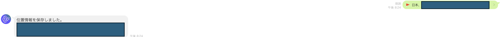
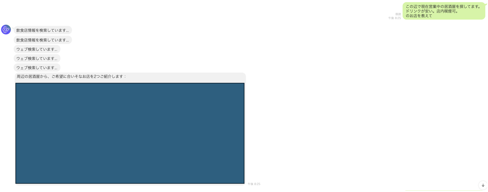

# LINE x AgentCore 飲食店サポートエージェント

LINEメッセージを受け取り、Amazon Bedrock AgentCore Runtime 上のエージェントに処理を委譲して、近隣の飲食店提案と位置案内を行うPoC実装です。

## 構成

1. `lambda/lambda_function.py`
LINE Webhook を受ける入口です。署名検証、AgentCore Runtime呼び出し、SSE応答のLINE送信を担当します。

2. `src/agent.py`
AgentCore Runtime 側の本体です。決定論ロジックと LLM + ツール呼び出しを統合しています。

3. `src/requirements.txt`
Runtime側の依存ライブラリです。

## 処理フロー

1. LINE から Webhook が Lambda に到達します。
2. Lambda が `x-line-signature` を検証します。不正なら `400` を返します。
3. `message` イベントのみ処理します。
4. 送信元に応じて `reply_to` を決定します。
`groupId` → `roomId` → `userId` の優先順です。
5. `session_id` は `reply_to` をそのまま使います（チャット単位のセッション）。
6. メッセージ種別で分岐します。
テキストならそのまま `prompt` として AgentCore Runtime に送信します。
位置情報なら `__set_location__ {json}` 形式に変換して送信します。
7. RuntimeのSSEを逐次処理します。
ツール開始時は進捗メッセージを先に push し、最終テキストブロックのみ本文として push します。

## 動作イメージ

### 位置情報の保存



ユーザーがLINEの「＋」から位置情報を送ると、Lambdaが `__set_location__` 形式に変換して Runtime に渡し、セッション単位で以下を保持します。

1. 緯度経度（`lat` / `lng`）
2. 位置タイトル（`title`）
3. 住所（`address`）

### web検索と周辺の飲食店検索



会話の意図に応じて処理を分岐します。

1. 一般情報の質問は `websearch`（Tavily API）で補助回答します。
2. 飲食店の検索・おすすめは `restaurant_search`（Hotpepper API）を優先して実行します。
3. 「〇〇駅西口周辺の居酒屋」のような駅出口指定がある場合は、出口条件を優先して候補を並び替え、反対出口（例: 東口）候補を避けるようにしています。
4. 候補提示時は位置情報を伏せ、ユーザーが番号や店名を選んだ後に `restaurant_location` で地図リンクを返します。

## Runtime 内部ロジック

### 1. セッション状態

インメモリ辞書で2種類の状態を保持します。

1. `_SESSION_LOCATION`
セッション単位の最後の位置情報（緯度経度、住所、タイトル）。

2. `_SESSION_RECOMMENDATIONS`
直近で提示した店舗候補（最大5件）。

注意: どちらもメモリ保持なので、コールドスタートやスケールアウトで失われる可能性があります。

### 2. 決定論ハンドリング（LLMを呼ぶ前）

`_deterministic_response` が次を先に処理します。

1. `__set_location__` コマンド
位置情報を保存し、候補一覧をクリアします。

2. 候補選択メッセージ
「2件目」「これがいい」「店名指定」などを解釈し、該当店舗の詳細と地図リンクを返します。

3. 挨拶
挨拶文はツールを使わず固定応答します。

### 3. LLM + ツール実行

決定論で確定しない入力は `strands.Agent` に委譲します。使用ツールは3つです。

1. `restaurant_search`
Hotpepper APIで周辺店舗を検索します。
範囲は `range_level` を開始値として段階的に拡張します（最大3000m）。
候補提示時は住所・座標・地図リンクを出しません。

2. `restaurant_location`
直近候補からユーザー選択を解釈し、住所・座標・地図リンクを返します。

3. `websearch`
Tavily APIで一般Web検索します。

## Lambda のSSE処理仕様

`process_sse_stream` は Bedrock Converse Stream 形式を前提に以下を処理します。

1. `contentBlockDelta.delta.text`
本文をバッファに連結します。

2. `contentBlockStart.start.toolUse`
ツール実行開始を検知し、ツール名に応じた日本語ステータスメッセージを push します。

3. `contentBlockStop`
ブロック確定時点の本文を `last_text_block` として保持します。

4. 最後に `last_text_block` のみ送信します（`FINAL_TEXT_LIMIT` で上限カット）。

## 環境変数

### Lambda (`lambda/lambda_function.py`)

| 変数名 | 必須 | 既定値 | 説明 |
|---|---|---|---|
| `LINE_CHANNEL_SECRET` | 必須 | なし | LINE署名検証用シークレット |
| `LINE_CHANNEL_ACCESS_TOKEN` | 必須 | なし | LINE Messaging API送信用トークン |
| `AGENTCORE_RUNTIME_ARN` | 必須 | なし | 呼び出し先 AgentCore Runtime ARN |
| `AGENTCORE_REGION` | 任意 | `us-west-2` | Runtime 呼び出しリージョン |
| `LOADING_SECONDS` | 任意 | `60` | LINEローディング表示秒数（5-60） |
| `MIN_SEND_INTERVAL` | 任意 | `1.0` | push最小送信間隔（秒） |
| `FINAL_TEXT_LIMIT` | 任意 | `5000` | 最終本文の最大文字数 |

### Runtime (`src/agent.py`)

| 変数名 | 必須 | 既定値 | 説明 |
|---|---|---|---|
| `MODEL_ID` | 実質必須 | `us.anthropic.claude-haiku-4-5-20251001-v1:0` | 利用するBedrockモデルID |
| `TAVILY_API_KEY` | 任意 | コード内デフォルト値 | Web検索用APIキー |
| `RECRUIT_HOTPEPPER_API_KEY` | 任意 | コード内デフォルト値 | Hotpepper APIキー |
| `SEARCH_DEBUG` | 任意 | `0` | `1` でHotpepper検索候補（試行キーワード/件数）をRuntimeログへ出力 |

## セットアップの最小手順

1. Runtime依存をインストールします。
```bash
pip install -r src/requirements.txt
```
2. AgentCore Runtime に `src/agent.py` をデプロイし、環境変数を設定します。
3. Lambda をデプロイして `lambda/lambda_function.py` を設定し、環境変数を設定します。
4. API Gateway などで LINE Webhook を Lambda に接続します。
5. LINE Developers 側で Webhook URL を設定し、疎通確認します。

## 運用上の注意

1. `src/agent.py` には APIキーのデフォルト値が記述されています。実運用では必ず環境変数で上書きし、コード側の埋め込み値は削除してください。
2. セッション状態はインメモリのため永続化されません。運用では DynamoDB などの外部ストア利用を推奨します。
3. Lambdaは本文を最終ブロック1通で返す設計です。逐次全文表示が必要なら `process_sse_stream` の送信戦略を変更してください。
