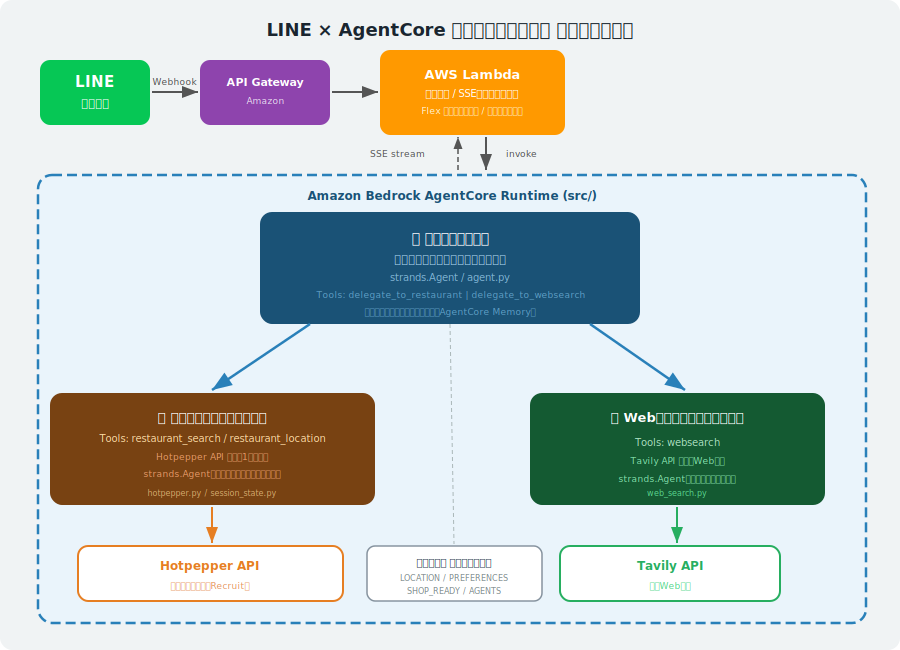

# LINE × AgentCore 飲食店サポートエージェント

LINEメッセージを受け取り、Amazon Bedrock AgentCore Runtime 上の**マルチエージェント**に処理を委譲して、近隣の飲食店提案と位置案内を行う PoC 実装です。

---

## クイックスタート

```bash
# AgentCore Runtime + Lambda を一括デプロイ
./deploy.sh
```

> `./deploy.sh` は以下を自動で実行します:
> 1. `agentcore deploy` でコードを AgentCore Runtime にアップロード
> 2. `update-agent-runtime` で環境変数を再設定（デプロイで上書きされるため）
> 3. Lambda `bedrock-agentcore-line-bot` のコードを更新

---

## アーキテクチャ全体図



```
[LINE ユーザー]
    ↓ Webhook
[API Gateway]
    ↓
[Lambda: lambda_function.py]
  署名検証 / SSEストリーム処理 / Flexメッセージ生成
    ↓ invoke / SSE stream
[Bedrock AgentCore Runtime]
    ↓
  [監督エージェント]
    ├─ delegate_to_restaurant ──→ [飲食店専門家]
    │                               ↓ MCPClient
    │                           [AgentCore Gateway]
    │                               ↓
    │                           [hotpepper_gateway_tool Lambda]
    │                               ↓ @requires_access_token (M2M)
    │                           [Hotpepper API]
    │
    └─ delegate_to_websearch ──→ [Web検索専門家]
                                    ↓ MCPClient
                                [AgentCore Gateway]
                                    ↓
                                [websearch_gateway_tool Lambda]
                                    ↓ @requires_access_token (M2M)
                                [Tavily API]

[AgentCore Identity]  ← APIキーをM2M認証で安全に管理
[AgentCore Memory]    ← ユーザーの訪問履歴・嗜好を永続記録
```

---

## AWSリソース一覧（us-west-2）

| リソース | ID / 名前 |
|---|---|
| AgentCore Runtime ID | `line_agentcore-dsoclNGvM6` |
| Lambda 関数名 | `bedrock-agentcore-line-bot` |
| AgentCore Memory ID | `line_agentcore_mem-9qQz574MzM` |
| Gateway URL | `https://line-agentcore-searchgateway-chfuqejvmv.gateway.bedrock-agentcore.us-west-2.amazonaws.com/mcp` |
| S3 バケット（コードソース） | `bedrock-agentcore-codebuild-sources-017820658462-us-west-2` |

---

## 構成ファイル

### Lambda（`lambda/`）

| ファイル | 役割 |
|---|---|
| `lambda_function.py` | LINE Webhook の入口。署名検証・SSEストリーム処理・Flexメッセージ送信 |
| `hotpepper_gateway_tool.py` | Gateway に登録される Hotpepper 検索 Lambda ツール |
| `websearch_gateway_tool.py` | Gateway に登録される Web 検索 Lambda ツール |
| `map_handler.py` | ユーザーの訪問済み店舗マップを提供する Lambda |

### AgentCore Runtime（`src/`）

| ファイル | 役割 |
|---|---|
| `agent.py` | エントリポイント。監督・飲食店・Web検索の3エージェントを定義しオーケストレート |
| `hotpepper.py` | Hotpepper API 検索・キーワード処理・スコアリング・フォーマット |
| `session_state.py` | セッション単位のインメモリ状態管理（位置情報・嗜好・推薦候補） |
| `web_search.py` | Tavily API を使った Web 検索 |
| `http_utils.py` | HTTP クライアント共通ユーティリティ |
| `agentcore_memory.py` | AgentCore Memory への訪問記録保存・嗜好検索（長期記憶） |
| `requirements.txt` | Runtime 側の依存ライブラリ |

### セットアップスクリプト（`setup/`）

| ファイル | 役割 |
|---|---|
| `setup_identity.py` | AgentCore Identity に Hotpepper / Tavily の認証情報を M2M プロバイダーとして登録 |
| `setup_gateway.py` | AgentCore Gateway を作成し、2つの Lambda ツールを MCP ツールとして登録 |

---

## マルチエージェント構成

```
[監督エージェント]  ← すべてのユーザー入力を受け取り意図を判断
   │
   ├─ delegate_to_restaurant ──→ [飲食店専門家エージェント]
   │                                  ├─ hotpepper_search  (Gateway MCP → Hotpepper API)
   │                                  └─ restaurant_location (地図リンク生成)
   │
   └─ delegate_to_websearch ───→ [Web検索専門家エージェント]
                                       └─ web_search  (Gateway MCP → Tavily API)
```

| エージェント | 担当 | キャッシュ |
|---|---|---|
| 監督エージェント | 意図判断・ルーティング・挨拶対応 | セッション単位（会話履歴保持）|
| 飲食店専門家 | Hotpepper 検索・店舗選択 | セッション単位（状態保持）|
| Web検索専門家 | Tavily 一般検索 | 全セッション共有（ステートレス）|

### Gateway フォールバック

`GATEWAY_URL` が設定されていない場合、各エージェントは直接 APIキー（`HOTPEPPER_API_KEY` / `TAVILY_API_KEY`）を使ってフォールバック動作します。開発・PoC 環境では Gateway なしでも動作します。

---

## 処理フロー

### 1. 位置情報の保存

1. ユーザーが LINE の「＋」から位置情報を送信
2. Lambda が `__set_location__ {json}` 形式に変換して AgentCore に送信
3. 決定論ハンドラで即座に処理し、セッションに緯度経度・住所・タイトルを保存

### 2. Web検索と周辺の飲食店検索

1. 監督エージェントがユーザーの意図を解析してルーティング
2. 飲食店の質問 → `delegate_to_restaurant` → 飲食店専門家エージェント → Gateway → Hotpepper API
3. 一般的な質問 → `delegate_to_websearch` → Web検索専門家エージェント → Gateway → Tavily API
4. 飲食店は **1件のみ**推薦（住所・座標は伏せる）
5. 推薦後に「✅ ここに決定 / 🔄 再度検索」の Flex メッセージを表示
6. 決定ボタン押下で位置情報（Google Maps リンク）を送信し、嗜好を AgentCore Memory に記録

---

## Runtime 内部ロジック

### 1. セッション状態（`session_state.py`）

インメモリ辞書で 4 種類の状態を保持します。

| 変数 | 内容 |
|---|---|
| `_SESSION_LOCATION` | セッション単位の最後の位置情報（緯度経度・住所・タイトル）|
| `_SESSION_RECOMMENDATIONS` | 直近で提示した店舗候補（1件）|
| `_SESSION_PREFERENCES` | 確定済みジャンル・訪問済み店名（インメモリ + AgentCore Memory）|
| `_SESSION_SHOP_READY` | 確認ボタン送出用の確認待ち店舗（LLM を経由させずに保持）|

> **注意**: インメモリのためコールドスタートやスケールアウトで失われます。長期記憶は AgentCore Memory で永続化されます。

### 2. 特殊コマンド処理（LLM 不要）

`_handle_special_command` が以下を決定論で処理します。

| コマンド | 処理内容 |
|---|---|
| `__set_location__ {json}` | 位置情報を保存し推薦候補をクリア |
| `__confirm__ {json}` | 訪問済み店舗を `_SESSION_PREFERENCES` と AgentCore Memory に記録 |

### 3. `__SHOP_CONFIRM__` マーカーの仕組み

LLM を経由させると確認ボタン用のマーカーが消えてしまうため、以下の方法で確実に届けます。

```
Hotpepper 検索 → _set_recommendations()
    └─→ _SESSION_SHOP_READY[session_id] に店舗データを保存
監督エージェントのストリーム終了後
    └─→ _pop_shop_ready() → "__SHOP_CONFIRM__:{json}" を独立ブロックで yield
Lambda が全ブロックをスキャンして検出 → Flex メッセージ送信
```

### 4. AgentCore Memory（`agentcore_memory.py`）

「ここに決定」ボタン押下時に訪問確定情報を AgentCore Memory に永続記録します。

- `record_restaurant_visit()`: 店名・ジャンルを Memory に `create_event` で記録
- `retrieve_user_preferences()`: セマンティック検索で過去の嗜好を取得（TTL 5分キャッシュ）
- コールドスタート後も過去の訪問履歴・嗜好をエージェントのプロンプトに注入できます

---

## Lambda の SSE 処理仕様

`process_sse_stream` は Bedrock Converse Stream 形式を処理します。

| イベント | 処理 |
|---|---|
| `contentBlockDelta.delta.text` | 本文をバッファに連結 |
| `contentBlockStart.start.toolUse` | ツール名に応じた日本語ステータスを push |
| `contentBlockStop` | ブロック確定。`__SHOP_CONFIRM__:` 行を検出した場合は `pending_shop_data` に保存し `last_text_block` は更新しない |
| ストリーム終了後 | `pending_shop_data` があれば本文テキスト + Flex メッセージを送信 |

---

## 環境変数

### Lambda（`lambda/lambda_function.py`）

| 変数名 | 必須 | 既定値 | 説明 |
|---|---|---|---|
| `LINE_CHANNEL_SECRET` | ✅ | なし | LINE 署名検証用シークレット |
| `LINE_CHANNEL_ACCESS_TOKEN` | ✅ | なし | LINE Messaging API 送信用トークン |
| `AGENTCORE_RUNTIME_ARN` | ✅ | なし | 呼び出し先 AgentCore Runtime ARN |
| `AGENTCORE_REGION` | | `us-west-2` | Runtime 呼び出しリージョン |
| `LOADING_SECONDS` | | `60` | LINE ローディング表示秒数（5〜60）|
| `MIN_SEND_INTERVAL` | | `1.0` | push 最小送信間隔（秒）|
| `FINAL_TEXT_LIMIT` | | `5000` | 最終本文の最大文字数 |

### Runtime（`src/agent.py`）

| 変数名 | 必須 | 既定値 | 説明 |
|---|---|---|---|
| `MODEL_ID` | 実質必須 | `us.anthropic.claude-haiku-4-5-20251001-v1:0` | 利用する Bedrock モデル ID |
| `AGENTCORE_MEMORY_ID` | | `line_agentcore_mem-9qQz574MzM` | AgentCore Memory の ID |
| `AGENTCORE_REGION` | | `us-west-2` | AgentCore Memory / Gateway のリージョン |
| `GATEWAY_URL` | | `` (空) | Gateway MCP エンドポイント URL |
| `GATEWAY_PROVIDER_NAME` | | `GatewayAuthProvider` | Gateway 認証用 Identity プロバイダー名 |
| `HOTPEPPER_API_KEY` | | `` | フォールバック用 Hotpepper API キー（Gateway 未使用時のみ必要）|
| `TAVILY_API_KEY` | | `` | フォールバック用 Tavily API キー（Gateway 未使用時のみ必要）|
| `SEARCH_DEBUG` | | `0` | `1` で Hotpepper 検索デバッグログを出力 |

### Gateway ツール Lambda（`lambda/hotpepper_gateway_tool.py` / `websearch_gateway_tool.py`）

| 変数名 | 必須 | 説明 |
|---|---|---|
| `HOTPEPPER_API_KEY` | ✅ | Hotpepper API キー |
| `TAVILY_API_KEY` | ✅ | Tavily API キー |

---

## セットアップ手順（新規環境向け）

> **既存環境へのデプロイは `./deploy.sh` のみで OK です。**
> 以下は Gateway / Identity を一から構築する場合の手順です。

### 前提条件

- AWS CLI / `aws login` で認証済み
- Python 仮想環境を有効化済み: `source .venv/bin/activate`
- LINE Developers でチャンネル作成済み

### 1. 依存ライブラリをインストール

```bash
pip install -r src/requirements.txt
```

### 2. AgentCore Identity にAPIキーを登録

Cognito User Pool と App Client を事前に作成した上で実行します。

```bash
HOTPEPPER_API_KEY=<HotpepperのAPIキー> \
TAVILY_API_KEY=<TavilyのAPIキー> \
COGNITO_DISCOVERY_URL=https://cognito-idp.us-west-2.amazonaws.com/<UserPoolId>/.well-known/openid-configuration \
COGNITO_CLIENT_ID=<CognitoクライアントID> \
COGNITO_CLIENT_SECRET=<Cognitoクライアントシークレット> \
python setup/setup_identity.py
```

→ `setup/identity_config.json` が生成されます。

### 3. Gateway ツール Lambda をデプロイ

```bash
cd lambda/
zip hotpepper_gateway_tool.zip hotpepper_gateway_tool.py
aws lambda create-function \
  --function-name hotpepper_gateway_tool \
  --runtime python3.12 \
  --zip-file fileb://hotpepper_gateway_tool.zip \
  --handler hotpepper_gateway_tool.lambda_handler \
  --region us-west-2

zip websearch_gateway_tool.zip websearch_gateway_tool.py
aws lambda create-function \
  --function-name websearch_gateway_tool \
  --runtime python3.12 \
  --zip-file fileb://websearch_gateway_tool.zip \
  --handler websearch_gateway_tool.lambda_handler \
  --region us-west-2
```

### 4. AgentCore Gateway を作成

```bash
HOTPEPPER_LAMBDA_ARN=arn:aws:lambda:us-west-2:<アカウントID>:function:hotpepper_gateway_tool \
WEBSEARCH_LAMBDA_ARN=arn:aws:lambda:us-west-2:<アカウントID>:function:websearch_gateway_tool \
python setup/setup_gateway.py
```

→ `setup/gateway_config.json` と Runtime に設定すべき環境変数が出力されます。

### 5. AgentCore Runtime にデプロイ

```bash
./deploy.sh
```

- Handler: `invoke_agent`（`@app.entrypoint` の関数名）
- `GATEWAY_URL` / `GATEWAY_PROVIDER_NAME` は `deploy.sh` 内に記載済み

### 6. Webhook Lambda をデプロイ

`./deploy.sh` の Step 3 で自動実行されます。手動で行う場合:

```bash
cd lambda/
zip -q function.zip lambda_function.py
aws lambda update-function-code \
  --function-name bedrock-agentcore-line-bot \
  --zip-file fileb://function.zip \
  --region us-west-2
```

### 7. API Gateway → LINE Webhook を接続

1. API Gateway で HTTP API を作成（POST /webhook）
2. Lambda と統合
3. **エンドポイント URL を LINE Developers の Webhook URL に設定**
4. 「Verify」で疎通確認 ✅

---

## ログ確認

```bash
# AgentCore Runtime ログ
aws logs tail /aws/bedrock-agentcore/runtimes/line_agentcore-dsoclNGvM6-DEFAULT \
  --log-stream-name-prefix "$(date +%Y/%m/%d)/[runtime-logs" --follow

# Lambda ログ
aws logs tail /aws/lambda/bedrock-agentcore-line-bot --follow
```

---

## 運用上の注意

1. **APIキー管理**: Gateway を使うと `HOTPEPPER_API_KEY` / `TAVILY_API_KEY` を Identity で安全管理できます。Gateway なしのフォールバック環境では環境変数で直接指定してください。
2. **セッション状態の永続化**: インメモリのためコールドスタートで失われます。本番運用では DynamoDB などの外部ストア利用を推奨します。長期嗜好記憶は AgentCore Memory で永続化されます。
3. **`__SHOP_CONFIRM__` マーカー**: LLM を経由させず `_SESSION_SHOP_READY` 経由で送出しているため、監督エージェントが書き換えても確認ボタンは正常に動作します。
4. **スケールアウト対策**: Lambda がスケールアウトすると `_PENDING_SHOPS`（確認待ち店舗）がコンテナ間で共有されません。本番では DynamoDB に移行してください。
5. **Reply API の使用**: Push API（有料・レート制限あり）ではなく Reply API（無制限・無料）を使用しています。replyToken の有効期限（約30秒）内に返信する必要があります。
